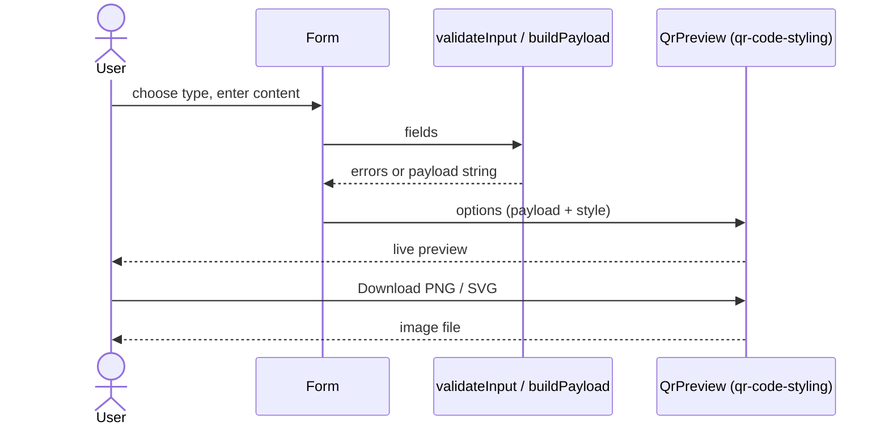

# QR Code Builder Implementation Plan

> **For agentic workers:** REQUIRED SUB-SKILL: Use superpowers:subagent-driven-development (recommended) or superpowers:executing-plans to implement this plan task-by-task. Steps use checkbox (`- [ ]`) syntax for tracking.

**Goal:** Build a client-side Nuxt app that turns a URL, phone number, or other content into a styled QR code the user can download as PNG or SVG.

**Architecture:** Nuxt 4 SPA (`ssr: false`). Pure TypeScript utilities (`payload`, `validate`, `contrast`, `qrOptions`) hold all logic and are unit-tested in isolation. Thin Vue components (tabs, data-driven form, style panel, preview) wrap them. `qr-code-styling` renders and exports, loaded dynamically in the browser only. Packaged as a static build served by nginx in Docker.

**Tech Stack:** Nuxt 4, Vue 3, TypeScript, Tailwind CSS 4, `qr-code-styling`, Vitest + Testing Library, Playwright (`jsqr` + `pngjs` to decode downloads), Docker/nginx.

**Spec:** `docs/superpowers/specs/2026-10-06-qr-code-builder-design.md`

## Global Constraints

- Language: TypeScript everywhere; Vue 3 / Nuxt 4 for the UI; Tailwind for styling.
- No backend, no database, no accounts; logos and content never leave the browser.
- Phone numbers are encoded as `tel:<number>`.
- Error-correction level is forced to `H` whenever a logo is present.
- Exports: PNG and SVG only.
- Config lives in `.env` files (`.env.example` committed); `NUXT_ADD_DEBUG_LOGS` gates trace logging.
- Unit tests with Vitest; component tests with Testing Library (query by role/label for accessibility); UI automation with Playwright scripts.
- Git: work only on branch `feat/qr-code-builder`; commit prefixes `feat:` `bugfix:` `secfix:` `refactor:` `config:` `docs:`; end every commit message with `Co-Authored-By: Claude Sonnet 5.5 <noreply@anthropic.com>`; nothing is committed to `main`; changes land via Pull Request.
- UI design comes from the Stitch MCP; the Stitch project id is persisted in project memory.
- Components import `ref/computed/...` explicitly from `vue` (so Vitest runs them without Nuxt auto-imports).

## Review Focus

- Content longer than QR capacity (e.g. 5,000 chars): preview shows a clear message instead of crashing; downloads are disabled. (Task 8)
- Phone input containing letters (`555-CALL`) must be rejected, not silently stripped to `555`. (Task 4)
- Wi-Fi/vCard values containing `; , : " \` or newlines must be escaped so they don't corrupt the payload. (Task 3)
- A logo file that is not PNG/JPG/SVG, or larger than 1 MB, is rejected with a visible message. (Task 9)
- Light-on-dark (inverted) or low-contrast colors show a "may not scan" warning. (Task 5)

## File Structure

```
package.json, nuxt.config.ts, tsconfig.json, vitest.config.ts, playwright.config.ts
.env, .env.example, .gitignore, Dockerfile, nginx.conf, docker-compose.yml, CLAUDE.md
app/app.vue
app/assets/css/main.css
app/pages/index.vue                 page assembly only
app/plugins/debug.client.ts         reads runtimeConfig -> setDebug()
app/composables/useQrStyle.ts       style state + contrast warning
app/utils/payload.ts                ContentType, QrInput, buildPayload (pure)
app/utils/validate.ts               validateInput (pure)
app/utils/contrast.ts               contrastRatio, contrastWarning (pure)
app/utils/qrOptions.ts              StyleState, defaultStyle, buildQrOptions (pure)
app/utils/fields.ts                 TYPES, FIELD_DEFS, defaultFields (data)
app/utils/log.ts                    setDebug, debugLog
app/components/ContentTypeTabs.vue
app/components/ContentForm.vue      data-driven from FIELD_DEFS
app/components/StylePanel.vue
app/components/QrPreview.vue        client-only qr-code-styling wrapper
app/components/DownloadButtons.vue
tests/setup.ts
tests/unit/*.test.ts
tests/e2e/qr.spec.ts
docs/...
```

---

### Task 1: Project scaffold and tooling

**Files:**
- Create: `package.json`, `nuxt.config.ts`, `tsconfig.json`, `vitest.config.ts`, `.gitignore`, `.env`, `.env.example`, `app/app.vue`, `app/pages/index.vue`, `app/assets/css/main.css`, `tests/setup.ts`, `tests/unit/smoke.test.ts`

**Interfaces:**
- Produces: working `npm run dev|generate|test` commands; `~` alias resolves to `app/` in Vitest.

- [ ] **Step 1: Create `package.json`, then install dependencies**

```json
{
  "name": "qr-code-builder",
  "private": true,
  "type": "module",
  "scripts": {
    "dev": "nuxt dev",
    "build": "nuxt build",
    "generate": "nuxt generate",
    "preview": "nuxt preview",
    "postinstall": "nuxt prepare",
    "typecheck": "nuxt typecheck",
    "test": "vitest run",
    "test:e2e": "playwright test"
  }
}
```

Run:
```bash
cd /mnt/data/sources/tryyourideas/web/qr-code-builder
npm install nuxt vue vue-router qr-code-styling
npm install -D tailwindcss @tailwindcss/vite typescript vue-tsc vitest @vitejs/plugin-vue @vue/test-utils @testing-library/vue @testing-library/user-event @testing-library/jest-dom jsdom @playwright/test jsqr pngjs @types/pngjs
```
Expected: installs without errors.

- [ ] **Step 2: Write config files**

`nuxt.config.ts`:
```ts
import tailwindcss from '@tailwindcss/vite'

export default defineNuxtConfig({
  compatibilityDate: '2026-10-01',
  ssr: false,
  devtools: { enabled: false },
  css: ['~/assets/css/main.css'],
  vite: { plugins: [tailwindcss()] },
  runtimeConfig: {
    public: { addDebugLogs: process.env.NUXT_ADD_DEBUG_LOGS === 'true' },
  },
  app: { head: { title: 'QR Code Builder', htmlAttrs: { lang: 'en' } } },
})
```

`tsconfig.json`:
```json
{
  "files": [],
  "references": [
    { "path": "./.nuxt/tsconfig.app.json" },
    { "path": "./.nuxt/tsconfig.server.json" },
    { "path": "./.nuxt/tsconfig.shared.json" },
    { "path": "./.nuxt/tsconfig.node.json" }
  ]
}
```

`vitest.config.ts`:
```ts
import { defineConfig } from 'vitest/config'
import vue from '@vitejs/plugin-vue'
import { fileURLToPath } from 'node:url'

export default defineConfig({
  plugins: [vue()],
  resolve: { alias: { '~': fileURLToPath(new URL('./app', import.meta.url)) } },
  test: {
    environment: 'jsdom',
    globals: true,
    include: ['tests/unit/**/*.test.ts'],
    setupFiles: ['tests/setup.ts'],
  },
})
```

`tests/setup.ts`:
```ts
import '@testing-library/jest-dom/vitest'
```

`app/assets/css/main.css`:
```css
@import "tailwindcss";
```

`app/app.vue`:
```vue
<template>
  <NuxtPage />
</template>
```

`app/pages/index.vue` (placeholder replaced in Task 10):
```vue
<template>
  <main class="p-6"><h1 class="text-2xl font-semibold">QR Code Builder</h1></main>
</template>
```

`.gitignore`:
```
node_modules
.nuxt
.output
.env
dist
playwright-report
test-results
```

`.env.example` (and identical `.env`):
```
# Enables trace logging in the browser console (build-time for the static build)
NUXT_ADD_DEBUG_LOGS=false
# Host port for docker compose
APP_PORT=8080
```

`tests/unit/smoke.test.ts`:
```ts
import { fileURLToPath } from 'node:url'
import { existsSync } from 'node:fs'

describe('tooling', () => {
  it('resolves the ~ alias to app/', () => {
    expect(existsSync(fileURLToPath(new URL('../../app/app.vue', import.meta.url)))).toBe(true)
  })
})
```

- [ ] **Step 3: Verify tests and build**

Run: `npm test` — Expected: 1 passed.
Run: `npm run generate` — Expected: completes, `.output/public/index.html` exists.

- [ ] **Step 4: Commit**

```bash
git add -A
git commit -m "config: scaffold Nuxt 4 app with Tailwind, Vitest and Playwright" -m "Co-Authored-By: Claude Sonnet 5.5 <noreply@anthropic.com>"
```

---

### Task 2: Stitch UI design

**Files:**
- Create: `docs/design.md` (records the Stitch project id and screen id)
- Memory: project memory entry `stitch-project-id`

**Interfaces:**
- Produces: a Stitch screen used as the visual reference for Tasks 7–10.

- [ ] **Step 1: Check for an existing Stitch project id** in project memory (`MEMORY.md`). Expected: none.

- [ ] **Step 2: Create the project and screen**

Call `mcp__stitch__create_project` with title `QR Code Builder`. Then `mcp__stitch__generate_screen_from_text` on that project with this prompt:

> Single-page web app "QR Code Builder". Left column: tabs for URL, Phone, Email, SMS, Text, Wi-Fi, Contact; a form for the selected tab; a "Style" card with foreground/background color pickers, dot style, corner style, logo upload, size slider, error-correction select. Right column: a large live QR code preview card with "Download PNG" and "Download SVG" buttons beneath. Clean, modern, light theme, accessible contrast, responsive (stacks on mobile).

- [ ] **Step 3: Persist the id**

Write a memory file `stitch-project-id.md` (type `reference`) in the project memory directory with the project id and screen id, add a line to `MEMORY.md`, and write the same ids plus a one-line description into `docs/design.md`.

- [ ] **Step 4: Commit**

```bash
git add docs/design.md
git commit -m "docs: record Stitch design project" -m "Co-Authored-By: Claude Sonnet 5.5 <noreply@anthropic.com>"
```

---

### Task 3: Payload builder

**Files:**
- Create: `app/utils/payload.ts`
- Test: `tests/unit/payload.test.ts`

**Interfaces:**
- Produces:
  - `type ContentType = 'url'|'phone'|'email'|'sms'|'text'|'wifi'|'vcard'`
  - `type QrInput` (discriminated union on `type`, see code)
  - `normalizePhone(raw: string): string`, `normalizeUrl(raw: string): string`
  - `buildPayload(input: QrInput): string`

- [ ] **Step 1: Write the failing tests** — `tests/unit/payload.test.ts`

```ts
import { buildPayload, normalizePhone, normalizeUrl } from '~/utils/payload'

describe('normalizers', () => {
  it('adds https:// when the scheme is missing', () => {
    expect(normalizeUrl(' example.com/a ')).toBe('https://example.com/a')
    expect(normalizeUrl('http://example.com')).toBe('http://example.com')
  })
  it('keeps a leading + and strips formatting from phones', () => {
    expect(normalizePhone('+1 (555) 010-9999')).toBe('+15550109999')
    expect(normalizePhone('555.010.9999')).toBe('5550109999')
  })
})

describe('buildPayload', () => {
  it('url', () => {
    expect(buildPayload({ type: 'url', url: 'example.com' })).toBe('https://example.com')
  })
  it('phone uses tel:', () => {
    expect(buildPayload({ type: 'phone', phone: '+1 555 010 9999' })).toBe('tel:+15550109999')
  })
  it('email with subject and body is URL-encoded', () => {
    expect(buildPayload({ type: 'email', address: 'a@b.co', subject: 'Hi there', body: 'x&y' }))
      .toBe('mailto:a@b.co?subject=Hi%20there&body=x%26y')
    expect(buildPayload({ type: 'email', address: 'a@b.co' })).toBe('mailto:a@b.co')
  })
  it('sms', () => {
    expect(buildPayload({ type: 'sms', phone: '555 0100', message: 'hello' })).toBe('SMSTO:5550100:hello')
    expect(buildPayload({ type: 'sms', phone: '555 0100' })).toBe('SMSTO:5550100:')
  })
  it('text is passed through untouched, including unicode', () => {
    expect(buildPayload({ type: 'text', text: 'héllo 🌍' })).toBe('héllo 🌍')
  })
  it('wifi WPA', () => {
    expect(buildPayload({ type: 'wifi', ssid: 'home', password: 'secret', security: 'WPA' }))
      .toBe('WIFI:T:WPA;S:home;P:secret;;')
  })
  it('wifi open network has no password and hidden flag when set', () => {
    expect(buildPayload({ type: 'wifi', ssid: 'cafe', security: 'nopass', hidden: true }))
      .toBe('WIFI:T:nopass;S:cafe;H:true;;')
  })
  it('wifi escapes special characters in ssid and password', () => {
    expect(buildPayload({ type: 'wifi', ssid: 'a;b,c:d', password: 'p"w\\x', security: 'WPA' }))
      .toBe('WIFI:T:WPA;S:a\\;b\\,c\\:d;P:p\\"w\\\\x;;')
  })
  it('vcard builds v3.0 card with only provided fields', () => {
    const v = buildPayload({ type: 'vcard', firstName: 'Ada', lastName: 'Lovelace', phone: '+123', email: 'ada@x.org' })
    expect(v).toBe([
      'BEGIN:VCARD', 'VERSION:3.0', 'N:Lovelace;Ada;;;', 'FN:Ada Lovelace',
      'TEL:+123', 'EMAIL:ada@x.org', 'END:VCARD',
    ].join('\n'))
  })
  it('vcard escapes commas, semicolons, backslashes and newlines', () => {
    const v = buildPayload({ type: 'vcard', firstName: 'A,B;C', org: 'x\\y\nz' })
    expect(v).toContain('N:;A\\,B\\;C;;;')
    expect(v).toContain('ORG:x\\\\y\\nz')
    expect(v.split('\n')).not.toContain('z')
  })
})
```

- [ ] **Step 2: Run to verify failure**

Run: `npx vitest run tests/unit/payload.test.ts`
Expected: FAIL — cannot resolve `~/utils/payload`.

- [ ] **Step 3: Implement** — `app/utils/payload.ts`

```ts
export type ContentType = 'url' | 'phone' | 'email' | 'sms' | 'text' | 'wifi' | 'vcard'

export type QrInput =
  | { type: 'url'; url: string }
  | { type: 'phone'; phone: string }
  | { type: 'email'; address: string; subject?: string; body?: string }
  | { type: 'sms'; phone: string; message?: string }
  | { type: 'text'; text: string }
  | { type: 'wifi'; ssid: string; password?: string; security: 'WPA' | 'WEP' | 'nopass'; hidden?: boolean }
  | {
      type: 'vcard'
      firstName: string
      lastName?: string
      phone?: string
      email?: string
      org?: string
      url?: string
    }

export function normalizeUrl(raw: string): string {
  const t = raw.trim()
  return /^[a-z][a-z0-9+.-]*:\/\//i.test(t) ? t : `https://${t}`
}

export function normalizePhone(raw: string): string {
  const t = raw.trim()
  return (t.startsWith('+') ? '+' : '') + t.replace(/\D/g, '')
}

const escapeWifi = (s: string) => s.replace(/([\\;,:"])/g, '\\$1')
const escapeVcard = (s: string) =>
  s.replace(/\\/g, '\\\\').replace(/\r?\n/g, '\\n').replace(/([;,])/g, '\\$1')

export function buildPayload(input: QrInput): string {
  switch (input.type) {
    case 'url':
      return normalizeUrl(input.url)
    case 'phone':
      return `tel:${normalizePhone(input.phone)}`
    case 'email': {
      const q: string[] = []
      if (input.subject) q.push(`subject=${encodeURIComponent(input.subject)}`)
      if (input.body) q.push(`body=${encodeURIComponent(input.body)}`)
      return `mailto:${input.address.trim()}${q.length ? '?' + q.join('&') : ''}`
    }
    case 'sms':
      return `SMSTO:${normalizePhone(input.phone)}:${input.message ?? ''}`
    case 'text':
      return input.text
    case 'wifi': {
      const parts = [`T:${input.security}`, `S:${escapeWifi(input.ssid)}`]
      if (input.security !== 'nopass') parts.push(`P:${escapeWifi(input.password ?? '')}`)
      if (input.hidden) parts.push('H:true')
      return `WIFI:${parts.join(';')};;`
    }
    case 'vcard': {
      const first = input.firstName.trim()
      const last = (input.lastName ?? '').trim()
      const lines = [
        'BEGIN:VCARD',
        'VERSION:3.0',
        `N:${escapeVcard(last)};${escapeVcard(first)};;;`,
        `FN:${escapeVcard(`${first} ${last}`.trim())}`,
      ]
      if (input.org) lines.push(`ORG:${escapeVcard(input.org)}`)
      if (input.phone) lines.push(`TEL:${escapeVcard(input.phone.trim())}`)
      if (input.email) lines.push(`EMAIL:${escapeVcard(input.email.trim())}`)
      if (input.url) lines.push(`URL:${escapeVcard(input.url.trim())}`)
      lines.push('END:VCARD')
      return lines.join('\n')
    }
  }
}
```

- [ ] **Step 4: Run to verify pass**

Run: `npx vitest run tests/unit/payload.test.ts`
Expected: all PASS.

- [ ] **Step 5: Commit**

```bash
git add app/utils/payload.ts tests/unit/payload.test.ts
git commit -m "feat: add QR payload builder for all content types" -m "Co-Authored-By: Claude Sonnet 5.5 <noreply@anthropic.com>"
```

---

### Task 4: Input validation

**Files:**
- Create: `app/utils/validate.ts`
- Test: `tests/unit/validate.test.ts`

**Interfaces:**
- Consumes: `QrInput`, `normalizeUrl`, `normalizePhone` from `~/utils/payload`.
- Produces: `type ValidationErrors = Record<string, string>` (key = field key, e.g. `url`, `phone`); `validateInput(input: QrInput): ValidationErrors` — empty object means valid.

- [ ] **Step 1: Write the failing tests** — `tests/unit/validate.test.ts`

```ts
import { validateInput } from '~/utils/validate'

describe('validateInput', () => {
  it('accepts valid urls with or without scheme', () => {
    expect(validateInput({ type: 'url', url: 'example.com' })).toEqual({})
    expect(validateInput({ type: 'url', url: 'https://example.com/a?b=1' })).toEqual({})
    expect(validateInput({ type: 'url', url: 'http://localhost:3000' })).toEqual({})
  })
  it('rejects empty, spaced or host-less urls', () => {
    expect(validateInput({ type: 'url', url: '  ' })).toHaveProperty('url')
    expect(validateInput({ type: 'url', url: 'exa mple.com' })).toHaveProperty('url')
    expect(validateInput({ type: 'url', url: 'notaurl' })).toHaveProperty('url')
  })
  it('accepts formatted phone numbers', () => {
    expect(validateInput({ type: 'phone', phone: '+1 (555) 010-9999' })).toEqual({})
  })
  it('rejects phones with letters, too few digits or empty', () => {
    expect(validateInput({ type: 'phone', phone: '555-CALL' })).toHaveProperty('phone')
    expect(validateInput({ type: 'phone', phone: '12' })).toHaveProperty('phone')
    expect(validateInput({ type: 'phone', phone: '' })).toHaveProperty('phone')
  })
  it('email requires a valid address', () => {
    expect(validateInput({ type: 'email', address: 'a@b.co' })).toEqual({})
    expect(validateInput({ type: 'email', address: 'a@b' })).toHaveProperty('address')
  })
  it('sms requires a valid phone', () => {
    expect(validateInput({ type: 'sms', phone: '555 0100' })).toEqual({})
    expect(validateInput({ type: 'sms', phone: 'abc' })).toHaveProperty('phone')
  })
  it('text must be non-empty', () => {
    expect(validateInput({ type: 'text', text: '' })).toHaveProperty('text')
    expect(validateInput({ type: 'text', text: 'hi' })).toEqual({})
  })
  it('wifi requires ssid, and password unless open', () => {
    expect(validateInput({ type: 'wifi', ssid: '', security: 'WPA', password: 'x' })).toHaveProperty('ssid')
    expect(validateInput({ type: 'wifi', ssid: 'a', security: 'WPA', password: '' })).toHaveProperty('password')
    expect(validateInput({ type: 'wifi', ssid: 'a', security: 'nopass' })).toEqual({})
  })
  it('vcard requires first name; validates optional email/phone', () => {
    expect(validateInput({ type: 'vcard', firstName: '' })).toHaveProperty('firstName')
    expect(validateInput({ type: 'vcard', firstName: 'Ada', email: 'bad' })).toHaveProperty('email')
    expect(validateInput({ type: 'vcard', firstName: 'Ada', phone: 'x1' })).toHaveProperty('phone')
    expect(validateInput({ type: 'vcard', firstName: 'Ada' })).toEqual({})
  })
})
```

- [ ] **Step 2: Run to verify failure**

Run: `npx vitest run tests/unit/validate.test.ts`
Expected: FAIL — cannot resolve `~/utils/validate`.

- [ ] **Step 3: Implement** — `app/utils/validate.ts`

```ts
import { normalizePhone, normalizeUrl, type QrInput } from '~/utils/payload'

export type ValidationErrors = Record<string, string>

const EMAIL_RE = /^[^\s@]+@[^\s@]+\.[^\s@]+$/

function isValidPhone(raw: string): boolean {
  if (!/^[+\d\s().-]+$/.test(raw.trim())) return false
  return /^\+?\d{3,15}$/.test(normalizePhone(raw))
}

function isValidUrl(raw: string): boolean {
  const t = raw.trim()
  if (!t || /\s/.test(t)) return false
  try {
    const { hostname } = new URL(normalizeUrl(t))
    return hostname === 'localhost' || hostname.includes('.')
  } catch {
    return false
  }
}

export function validateInput(input: QrInput): ValidationErrors {
  const e: ValidationErrors = {}
  switch (input.type) {
    case 'url':
      if (!input.url.trim()) e.url = 'Enter a URL'
      else if (!isValidUrl(input.url)) e.url = 'Enter a valid URL, e.g. example.com'
      break
    case 'phone':
    case 'sms':
      if (!input.phone.trim()) e.phone = 'Enter a phone number'
      else if (!isValidPhone(input.phone)) e.phone = 'Enter a valid phone number (digits, optional leading +)'
      break
    case 'email':
      if (!input.address.trim()) e.address = 'Enter an email address'
      else if (!EMAIL_RE.test(input.address.trim())) e.address = 'Enter a valid email address'
      break
    case 'text':
      if (!input.text.trim()) e.text = 'Enter some text'
      break
    case 'wifi':
      if (!input.ssid.trim()) e.ssid = 'Enter the network name'
      if (input.security !== 'nopass' && !(input.password ?? '').length) e.password = 'Enter the password'
      break
    case 'vcard':
      if (!input.firstName.trim()) e.firstName = 'Enter a first name'
      if (input.email?.trim() && !EMAIL_RE.test(input.email.trim())) e.email = 'Enter a valid email address'
      if (input.phone?.trim() && !isValidPhone(input.phone)) e.phone = 'Enter a valid phone number'
      break
  }
  return e
}
```

- [ ] **Step 4: Run to verify pass**

Run: `npx vitest run tests/unit/validate.test.ts`
Expected: all PASS.

- [ ] **Step 5: Commit**

```bash
git add app/utils/validate.ts tests/unit/validate.test.ts
git commit -m "feat: add input validation for QR content types" -m "Co-Authored-By: Claude Sonnet 5.5 <noreply@anthropic.com>"
```

---

### Task 5: Contrast check, QR options, style composable

**Files:**
- Create: `app/utils/contrast.ts`, `app/utils/qrOptions.ts`, `app/composables/useQrStyle.ts`
- Test: `tests/unit/contrast.test.ts`, `tests/unit/qrOptions.test.ts`

**Interfaces:**
- Produces:
  - `contrastRatio(a: string, b: string): number | null` (hex `#rrggbb`; null if unparsable)
  - `contrastWarning(fg: string, bg: string): string | null`
  - `type DotStyle`, `type CornerStyle = 'square'|'rounded'|'dot'`, `type ErrorLevel = 'L'|'M'|'Q'|'H'`
  - `interface StyleState { fg: string; bg: string; dotStyle: DotStyle; cornerStyle: CornerStyle; size: number; errorLevel: ErrorLevel; logo: string | null }`
  - `defaultStyle(): StyleState`, `buildQrOptions(style: StyleState, data: string): Options` (`Options` from `qr-code-styling`)
  - `useQrStyle(): { style: StyleState (reactive); warning: ComputedRef<string | null> }`

- [ ] **Step 1: Write the failing tests**

`tests/unit/contrast.test.ts`:
```ts
import { contrastRatio, contrastWarning } from '~/utils/contrast'

describe('contrast', () => {
  it('computes WCAG ratio', () => {
    expect(contrastRatio('#000000', '#ffffff')).toBeCloseTo(21, 0)
    expect(contrastRatio('#12', '#ffffff')).toBeNull()
  })
  it('warns on low contrast', () => {
    expect(contrastWarning('#777777', '#888888')).toMatch(/low contrast/i)
  })
  it('warns on inverted (light on dark) codes', () => {
    expect(contrastWarning('#ffffff', '#000000')).toMatch(/inverted|light-on-dark/i)
  })
  it('returns null for dark on light and for unparsable colors', () => {
    expect(contrastWarning('#000000', '#ffffff')).toBeNull()
    expect(contrastWarning('red', '#ffffff')).toBeNull()
  })
})
```

`tests/unit/qrOptions.test.ts`:
```ts
import { nextTick } from 'vue'
import { buildQrOptions, defaultStyle } from '~/utils/qrOptions'
import { useQrStyle } from '~/composables/useQrStyle'

describe('buildQrOptions', () => {
  it('maps style to qr-code-styling options', () => {
    const o = buildQrOptions({ ...defaultStyle(), fg: '#112233', bg: '#eeeeee', dotStyle: 'rounded', size: 400 }, 'hello')
    expect(o.data).toBe('hello')
    expect(o.width).toBe(400)
    expect(o.dotsOptions).toMatchObject({ color: '#112233', type: 'rounded' })
    expect(o.backgroundOptions).toMatchObject({ color: '#eeeeee' })
    expect(o.qrOptions?.errorCorrectionLevel).toBe('M')
    expect(o.image).toBeUndefined()
  })
  it('forces error correction H when a logo is present', () => {
    const o = buildQrOptions({ ...defaultStyle(), errorLevel: 'L', logo: 'data:image/png;base64,AAAA' }, 'x')
    expect(o.qrOptions?.errorCorrectionLevel).toBe('H')
    expect(o.image).toBe('data:image/png;base64,AAAA')
  })
  it('maps corner styles', () => {
    expect(buildQrOptions({ ...defaultStyle(), cornerStyle: 'rounded' }, 'x').cornersSquareOptions?.type).toBe('extra-rounded')
    expect(buildQrOptions({ ...defaultStyle(), cornerStyle: 'dot' }, 'x').cornersDotOptions?.type).toBe('dot')
  })
})

describe('useQrStyle', () => {
  it('exposes a reactive contrast warning', async () => {
    const { style, warning } = useQrStyle()
    expect(warning.value).toBeNull()
    style.fg = '#ffffff'
    style.bg = '#000000'
    await nextTick()
    expect(warning.value).not.toBeNull()
  })
})
```

- [ ] **Step 2: Run to verify failure**

Run: `npx vitest run tests/unit/contrast.test.ts tests/unit/qrOptions.test.ts`
Expected: FAIL — modules not found.

- [ ] **Step 3: Implement**

`app/utils/contrast.ts`:
```ts
const LOW = 'Low contrast: this code may not scan reliably. Use a darker foreground on a lighter background.'
const INVERTED = 'Light-on-dark (inverted) codes are not read by some scanners. Prefer a dark foreground on a light background.'

function luminance(hex: string): number | null {
  const m = /^#?([0-9a-f]{6})$/i.exec(hex.trim())
  if (!m) return null
  const n = parseInt(m[1]!, 16)
  const [r, g, b] = [(n >> 16) & 255, (n >> 8) & 255, n & 255].map((v) => {
    const c = v / 255
    return c <= 0.03928 ? c / 12.92 : ((c + 0.055) / 1.055) ** 2.4
  }) as [number, number, number]
  return 0.2126 * r + 0.7152 * g + 0.0722 * b
}

export function contrastRatio(a: string, b: string): number | null {
  const la = luminance(a)
  const lb = luminance(b)
  if (la === null || lb === null) return null
  const [hi, lo] = la >= lb ? [la, lb] : [lb, la]
  return (hi + 0.05) / (lo + 0.05)
}

export function contrastWarning(fg: string, bg: string): string | null {
  const ratio = contrastRatio(fg, bg)
  if (ratio === null) return null
  if (ratio < 3) return LOW
  if (luminance(fg)! > luminance(bg)!) return INVERTED
  return null
}
```

`app/utils/qrOptions.ts`:
```ts
import type { Options } from 'qr-code-styling'

export type DotStyle = 'square' | 'dots' | 'rounded' | 'extra-rounded' | 'classy' | 'classy-rounded'
export type CornerStyle = 'square' | 'rounded' | 'dot'
export type ErrorLevel = 'L' | 'M' | 'Q' | 'H'

export interface StyleState {
  fg: string
  bg: string
  dotStyle: DotStyle
  cornerStyle: CornerStyle
  size: number
  errorLevel: ErrorLevel
  logo: string | null
}

export const defaultStyle = (): StyleState => ({
  fg: '#000000',
  bg: '#ffffff',
  dotStyle: 'square',
  cornerStyle: 'square',
  size: 300,
  errorLevel: 'M',
  logo: null,
})

const CORNERS = {
  square: { square: 'square', dot: 'square' },
  rounded: { square: 'extra-rounded', dot: 'dot' },
  dot: { square: 'dot', dot: 'dot' },
} as const

export function buildQrOptions(style: StyleState, data: string): Options {
  const c = CORNERS[style.cornerStyle]
  return {
    width: style.size,
    height: style.size,
    type: 'canvas',
    data,
    image: style.logo ?? undefined,
    margin: 10,
    qrOptions: { errorCorrectionLevel: style.logo ? 'H' : style.errorLevel },
    dotsOptions: { color: style.fg, type: style.dotStyle },
    cornersSquareOptions: { color: style.fg, type: c.square },
    cornersDotOptions: { color: style.fg, type: c.dot },
    backgroundOptions: { color: style.bg },
    imageOptions: { crossOrigin: 'anonymous', margin: 4, imageSize: 0.3 },
  }
}
```

`app/composables/useQrStyle.ts`:
```ts
import { computed, reactive } from 'vue'
import { contrastWarning } from '~/utils/contrast'
import { defaultStyle, type StyleState } from '~/utils/qrOptions'

export function useQrStyle() {
  const style = reactive<StyleState>(defaultStyle())
  const warning = computed(() => contrastWarning(style.fg, style.bg))
  return { style, warning }
}
```

- [ ] **Step 4: Run to verify pass**

Run: `npx vitest run tests/unit/contrast.test.ts tests/unit/qrOptions.test.ts`
Expected: all PASS.

- [ ] **Step 5: Commit**

```bash
git add app/utils/contrast.ts app/utils/qrOptions.ts app/composables/useQrStyle.ts tests/unit/contrast.test.ts tests/unit/qrOptions.test.ts
git commit -m "feat: add contrast check, QR options mapping and style composable" -m "Co-Authored-By: Claude Sonnet 5.5 <noreply@anthropic.com>"
```

---

### Task 6: Debug logging utility

**Files:**
- Create: `app/utils/log.ts`, `app/plugins/debug.client.ts`
- Test: `tests/unit/log.test.ts`

**Interfaces:**
- Produces: `setDebug(enabled: boolean): void`, `debugLog(message: string, data?: unknown): void` (prints `console.debug('[qr-code-builder]', ...)` only when enabled).

- [ ] **Step 1: Write the failing test** — `tests/unit/log.test.ts`

```ts
import { debugLog, setDebug } from '~/utils/log'

describe('debugLog', () => {
  afterEach(() => vi.restoreAllMocks())
  it('is silent by default and logs once enabled', () => {
    const spy = vi.spyOn(console, 'debug').mockImplementation(() => {})
    setDebug(false)
    debugLog('hidden')
    expect(spy).not.toHaveBeenCalled()
    setDebug(true)
    debugLog('shown', { a: 1 })
    expect(spy).toHaveBeenCalledWith('[qr-code-builder]', 'shown', { a: 1 })
  })
})
```

- [ ] **Step 2: Run to verify failure**

Run: `npx vitest run tests/unit/log.test.ts` — Expected: FAIL (module not found).

- [ ] **Step 3: Implement**

`app/utils/log.ts`:
```ts
let enabled = false

export function setDebug(value: boolean): void {
  enabled = value
}

export function debugLog(message: string, data?: unknown): void {
  if (!enabled) return
  if (data === undefined) console.debug('[qr-code-builder]', message)
  else console.debug('[qr-code-builder]', message, data)
}
```

`app/plugins/debug.client.ts`:
```ts
import { setDebug } from '~/utils/log'

export default defineNuxtPlugin(() => {
  setDebug(Boolean(useRuntimeConfig().public.addDebugLogs))
})
```

- [ ] **Step 4: Run to verify pass**

Run: `npx vitest run tests/unit/log.test.ts` — Expected: PASS.

- [ ] **Step 5: Commit**

```bash
git add app/utils/log.ts app/plugins/debug.client.ts tests/unit/log.test.ts
git commit -m "feat: add NUXT_ADD_DEBUG_LOGS-gated trace logging" -m "Co-Authored-By: Claude Sonnet 5.5 <noreply@anthropic.com>"
```

---

### Task 7: Content tabs and data-driven form

**Files:**
- Create: `app/utils/fields.ts`, `app/components/ContentTypeTabs.vue`, `app/components/ContentForm.vue`
- Test: `tests/unit/ContentTypeTabs.test.ts`, `tests/unit/ContentForm.test.ts`

**Interfaces:**
- Consumes: `ContentType` from `~/utils/payload`.
- Produces:
  - `TYPES: { value: ContentType; label: string }[]` (order: url, phone, email, sms, text, wifi, vcard; labels `URL`, `Phone`, `Email`, `SMS`, `Text`, `Wi-Fi`, `Contact`)
  - `FieldDef`, `FieldValues = Record<string, string | boolean>`, `FIELD_DEFS: Record<ContentType, FieldDef[]>`, `defaultFields(type: ContentType): FieldValues`
  - `ContentTypeTabs`: `v-model: ContentType`; tab buttons have `id="tab-<type>"`, `aria-controls="panel"`.
  - `ContentForm`: props `type: ContentType`, `errors: Record<string,string>`; `v-model: FieldValues`. Field keys equal the `QrInput` property names (`url`, `phone`, `address`, `subject`, `body`, `message`, `text`, `ssid`, `password`, `security`, `hidden`, `firstName`, `lastName`, `org`, `email`).

- [ ] **Step 1: Write the failing tests**

`tests/unit/ContentTypeTabs.test.ts`:
```ts
import { render, screen } from '@testing-library/vue'
import userEvent from '@testing-library/user-event'
import ContentTypeTabs from '~/components/ContentTypeTabs.vue'

function setup(modelValue = 'url') {
  const onUpdate = vi.fn()
  render(ContentTypeTabs, { props: { modelValue, 'onUpdate:modelValue': onUpdate } })
  return onUpdate
}

describe('ContentTypeTabs', () => {
  it('renders an accessible tablist with the selected tab marked', () => {
    setup('phone')
    expect(screen.getByRole('tablist', { name: 'Content type' })).toBeInTheDocument()
    expect(screen.getAllByRole('tab')).toHaveLength(7)
    expect(screen.getByRole('tab', { name: 'Phone' })).toHaveAttribute('aria-selected', 'true')
    expect(screen.getByRole('tab', { name: 'URL' })).toHaveAttribute('aria-selected', 'false')
  })
  it('selects on click', async () => {
    const onUpdate = setup()
    await userEvent.click(screen.getByRole('tab', { name: 'Email' }))
    expect(onUpdate).toHaveBeenCalledWith('email')
  })
  it('moves with arrow keys, wrapping around', async () => {
    const onUpdate = setup('url')
    screen.getByRole('tab', { name: 'URL' }).focus()
    await userEvent.keyboard('{ArrowLeft}')
    expect(onUpdate).toHaveBeenLastCalledWith('vcard')
    await userEvent.keyboard('{ArrowRight}')
    expect(onUpdate).toHaveBeenCalledTimes(2)
  })
})
```

`tests/unit/ContentForm.test.ts`:
```ts
import { render, screen } from '@testing-library/vue'
import userEvent from '@testing-library/user-event'
import ContentForm from '~/components/ContentForm.vue'
import { defaultFields } from '~/utils/fields'

describe('ContentForm', () => {
  it('labels every field and emits updates', async () => {
    const onUpdate = vi.fn()
    render(ContentForm, {
      props: { type: 'url', errors: {}, modelValue: defaultFields('url'), 'onUpdate:modelValue': onUpdate },
    })
    const input = screen.getByLabelText(/^URL/)
    await userEvent.type(input, 'a')
    expect(onUpdate).toHaveBeenCalledWith({ url: 'a' })
  })

  it('shows an error only after the field was touched, announced via aria-live', async () => {
    render(ContentForm, {
      props: { type: 'url', errors: { url: 'Enter a URL' }, modelValue: defaultFields('url') },
    })
    const input = screen.getByLabelText(/^URL/)
    expect(screen.queryByText('Enter a URL')).not.toBeInTheDocument()
    await userEvent.click(input)
    await userEvent.tab()
    expect(screen.getByText('Enter a URL')).toBeInTheDocument()
    expect(input).toHaveAttribute('aria-invalid', 'true')
    const describedBy = input.getAttribute('aria-describedby')!
    const region = document.getElementById(describedBy)!
    expect(region).toHaveAttribute('aria-live', 'polite')
    expect(region).toHaveTextContent('Enter a URL')
  })

  it('hides the wifi password when the network is open', () => {
    render(ContentForm, {
      props: { type: 'wifi', errors: {}, modelValue: { ...defaultFields('wifi'), security: 'nopass' } },
    })
    expect(screen.queryByLabelText(/Password/)).not.toBeInTheDocument()
    expect(screen.getByLabelText(/Network name/)).toBeInTheDocument()
  })

  it('renders a checkbox and a select for wifi', () => {
    render(ContentForm, { props: { type: 'wifi', errors: {}, modelValue: defaultFields('wifi') } })
    expect(screen.getByRole('checkbox', { name: /Hidden network/ })).toBeInTheDocument()
    expect(screen.getByRole('combobox', { name: /Security/ })).toBeInTheDocument()
  })
})
```

- [ ] **Step 2: Run to verify failure**

Run: `npx vitest run tests/unit/ContentTypeTabs.test.ts tests/unit/ContentForm.test.ts`
Expected: FAIL — modules not found.

- [ ] **Step 3: Implement**

`app/utils/fields.ts`:
```ts
import type { ContentType } from '~/utils/payload'

export type FieldValues = Record<string, string | boolean>

export interface FieldDef {
  key: string
  label: string
  kind: 'text' | 'url' | 'tel' | 'email' | 'password' | 'textarea' | 'select' | 'checkbox'
  required?: boolean
  placeholder?: string
  options?: { value: string; label: string }[]
  hiddenWhen?: { key: string; equals: string }
}

export const TYPES: { value: ContentType; label: string }[] = [
  { value: 'url', label: 'URL' },
  { value: 'phone', label: 'Phone' },
  { value: 'email', label: 'Email' },
  { value: 'sms', label: 'SMS' },
  { value: 'text', label: 'Text' },
  { value: 'wifi', label: 'Wi-Fi' },
  { value: 'vcard', label: 'Contact' },
]

export const FIELD_DEFS: Record<ContentType, FieldDef[]> = {
  url: [{ key: 'url', label: 'URL', kind: 'url', required: true, placeholder: 'example.com' }],
  phone: [{ key: 'phone', label: 'Phone number', kind: 'tel', required: true, placeholder: '+1 555 010 9999' }],
  email: [
    { key: 'address', label: 'Email address', kind: 'email', required: true },
    { key: 'subject', label: 'Subject', kind: 'text' },
    { key: 'body', label: 'Message', kind: 'textarea' },
  ],
  sms: [
    { key: 'phone', label: 'Phone number', kind: 'tel', required: true },
    { key: 'message', label: 'Message', kind: 'textarea' },
  ],
  text: [{ key: 'text', label: 'Text', kind: 'textarea', required: true }],
  wifi: [
    { key: 'ssid', label: 'Network name', kind: 'text', required: true },
    {
      key: 'security',
      label: 'Security',
      kind: 'select',
      options: [
        { value: 'WPA', label: 'WPA/WPA2/WPA3' },
        { value: 'WEP', label: 'WEP' },
        { value: 'nopass', label: 'None (open network)' },
      ],
    },
    { key: 'password', label: 'Password', kind: 'password', required: true, hiddenWhen: { key: 'security', equals: 'nopass' } },
    { key: 'hidden', label: 'Hidden network', kind: 'checkbox' },
  ],
  vcard: [
    { key: 'firstName', label: 'First name', kind: 'text', required: true },
    { key: 'lastName', label: 'Last name', kind: 'text' },
    { key: 'org', label: 'Organization', kind: 'text' },
    { key: 'phone', label: 'Phone', kind: 'tel' },
    { key: 'email', label: 'Email', kind: 'email' },
    { key: 'url', label: 'Website', kind: 'url' },
  ],
}

export function defaultFields(type: ContentType): FieldValues {
  const out: FieldValues = {}
  for (const f of FIELD_DEFS[type]) {
    out[f.key] = f.kind === 'checkbox' ? false : f.kind === 'select' ? f.options![0]!.value : ''
  }
  return out
}
```

`app/components/ContentTypeTabs.vue`:
```vue
<script setup lang="ts">
import { nextTick } from 'vue'
import { TYPES } from '~/utils/fields'
import type { ContentType } from '~/utils/payload'

const model = defineModel<ContentType>({ required: true })

function onKeydown(e: KeyboardEvent) {
  const i = TYPES.findIndex((t) => t.value === model.value)
  const n = TYPES.length
  let next = i
  if (e.key === 'ArrowRight') next = (i + 1) % n
  else if (e.key === 'ArrowLeft') next = (i - 1 + n) % n
  else if (e.key === 'Home') next = 0
  else if (e.key === 'End') next = n - 1
  else return
  e.preventDefault()
  model.value = TYPES[next]!.value
  nextTick(() => document.getElementById(`tab-${model.value}`)?.focus())
}
</script>

<template>
  <div role="tablist" aria-label="Content type" class="flex flex-wrap gap-1" @keydown="onKeydown">
    <button
      v-for="t in TYPES"
      :id="`tab-${t.value}`"
      :key="t.value"
      type="button"
      role="tab"
      :aria-selected="model === t.value"
      aria-controls="panel"
      :tabindex="model === t.value ? 0 : -1"
      class="rounded-md px-3 py-2 text-sm font-medium focus-visible:outline-2 focus-visible:outline-offset-2 focus-visible:outline-indigo-600"
      :class="model === t.value ? 'bg-indigo-600 text-white' : 'bg-slate-100 text-slate-800 hover:bg-slate-200'"
      @click="model = t.value"
    >
      {{ t.label }}
    </button>
  </div>
</template>
```

`app/components/ContentForm.vue`:
```vue
<script setup lang="ts">
import { computed, reactive } from 'vue'
import { FIELD_DEFS, type FieldDef, type FieldValues } from '~/utils/fields'
import type { ContentType } from '~/utils/payload'

const props = defineProps<{ type: ContentType; errors: Record<string, string> }>()
const model = defineModel<FieldValues>({ required: true })
const touched = reactive<Record<string, boolean>>({})

const fields = computed(() =>
  FIELD_DEFS[props.type].filter((f) => !f.hiddenWhen || model.value[f.hiddenWhen.key] !== f.hiddenWhen.equals),
)
const id = (f: FieldDef) => `field-${props.type}-${f.key}`
const error = (f: FieldDef) => (touched[f.key] ? props.errors[f.key] : undefined)
const set = (key: string, value: string | boolean) => {
  model.value = { ...model.value, [key]: value }
}
const inputType = (f: FieldDef) => (f.kind === 'url' || f.kind === 'text' ? 'text' : f.kind)
const inputMode = (f: FieldDef) => (f.kind === 'url' ? 'url' : undefined)
const base =
  'mt-1 block w-full rounded-md border border-slate-400 px-3 py-2 text-slate-900 focus-visible:outline-2 focus-visible:outline-indigo-600 aria-[invalid=true]:border-red-700'
</script>

<template>
  <div class="space-y-4">
    <div v-for="f in fields" :key="f.key">
      <label v-if="f.kind === 'checkbox'" class="flex items-center gap-2 text-sm">
        <input
          :id="id(f)"
          type="checkbox"
          :checked="Boolean(model[f.key])"
          @change="set(f.key, ($event.target as HTMLInputElement).checked)"
        />
        {{ f.label }}
      </label>
      <template v-else>
        <label :for="id(f)" class="block text-sm font-medium text-slate-800">
          {{ f.label }}<span v-if="f.required" aria-hidden="true"> *</span>
        </label>
        <select
          v-if="f.kind === 'select'"
          :id="id(f)"
          :class="base"
          :value="model[f.key] as string"
          @change="set(f.key, ($event.target as HTMLSelectElement).value)"
        >
          <option v-for="o in f.options" :key="o.value" :value="o.value">{{ o.label }}</option>
        </select>
        <textarea
          v-else-if="f.kind === 'textarea'"
          :id="id(f)"
          rows="3"
          :class="base"
          :value="model[f.key] as string"
          :aria-required="f.required || undefined"
          :aria-invalid="error(f) ? 'true' : undefined"
          :aria-describedby="`${id(f)}-error`"
          @input="set(f.key, ($event.target as HTMLTextAreaElement).value)"
          @blur="touched[f.key] = true"
        />
        <input
          v-else
          :id="id(f)"
          :type="inputType(f)"
          :inputmode="inputMode(f)"
          :placeholder="f.placeholder"
          :class="base"
          :value="model[f.key] as string"
          :aria-required="f.required || undefined"
          :aria-invalid="error(f) ? 'true' : undefined"
          :aria-describedby="`${id(f)}-error`"
          @input="set(f.key, ($event.target as HTMLInputElement).value)"
          @blur="touched[f.key] = true"
        />
        <p :id="`${id(f)}-error`" aria-live="polite" class="mt-1 min-h-5 text-sm text-red-700">{{ error(f) }}</p>
      </template>
    </div>
  </div>
</template>
```

- [ ] **Step 4: Run to verify pass**

Run: `npx vitest run tests/unit/ContentTypeTabs.test.ts tests/unit/ContentForm.test.ts`
Expected: all PASS. (If the "emits updates" assertion fails because the controlled `modelValue` prop is not re-rendered in the test, keep the assertion on the emitted value — that is what the component contract guarantees.)

- [ ] **Step 5: Commit**

```bash
git add app/utils/fields.ts app/components/ContentTypeTabs.vue app/components/ContentForm.vue tests/unit/ContentTypeTabs.test.ts tests/unit/ContentForm.test.ts
git commit -m "feat: add accessible content tabs and data-driven form" -m "Co-Authored-By: Claude Sonnet 5.5 <noreply@anthropic.com>"
```

---

### Task 8: QR preview and download buttons

**Files:**
- Create: `app/components/QrPreview.vue`, `app/components/DownloadButtons.vue`
- Test: `tests/unit/QrPreview.test.ts`, `tests/unit/DownloadButtons.test.ts`

**Interfaces:**
- Consumes: `Options` from `qr-code-styling`; `debugLog` from `~/utils/log`.
- Produces:
  - `QrPreview`: prop `options: Options | null`; emits `error(message: string | null)`; exposes `download(ext: 'png' | 'svg'): Promise<void>`. Root has `data-testid="qr-preview"`. Shows `role="alert"` message on render failure and a placeholder when `options` is null.
  - `DownloadButtons`: prop `disabled: boolean`; emits `download(ext: 'png' | 'svg')`; buttons named `Download PNG` / `Download SVG`.

- [ ] **Step 1: Write the failing tests**

`tests/unit/QrPreview.test.ts`:
```ts
import { render, screen, waitFor } from '@testing-library/vue'
import QrPreview from '~/components/QrPreview.vue'

const downloadSpy = vi.fn()

vi.mock('qr-code-styling', () => ({
  default: class {
    constructor(o: { data: string }) {
      if (o.data.length > 100) throw new Error('Code length overflow')
    }
    append() {}
    update(o: { data: string }) {
      if (o.data.length > 100) throw new Error('Code length overflow')
    }
    download(opts: unknown) {
      downloadSpy(opts)
    }
  },
}))

const opts = (data: string) => ({ data, width: 300, height: 300 })

describe('QrPreview', () => {
  beforeEach(() => {
    downloadSpy.mockClear()
    vi.spyOn(console, 'error').mockImplementation(() => {})
  })

  it('shows a placeholder when there is nothing to render', () => {
    render(QrPreview, { props: { options: null } })
    expect(screen.getByText(/fill in the form/i)).toBeInTheDocument()
  })

  it('shows a clear error when content exceeds QR capacity', async () => {
    const { emitted } = render(QrPreview, { props: { options: opts('x'.repeat(5000)) } })
    expect(await screen.findByRole('alert')).toHaveTextContent(/too long/i)
    await waitFor(() => expect(emitted().error?.at(-1)).toEqual([expect.stringMatching(/too long/i)]))
  })

  it('recovers when the content becomes valid again', async () => {
    const { rerender } = render(QrPreview, { props: { options: opts('x'.repeat(5000)) } })
    await screen.findByRole('alert')
    await rerender({ options: opts('short') })
    await waitFor(() => expect(screen.queryByRole('alert')).not.toBeInTheDocument())
  })
})
```

`tests/unit/DownloadButtons.test.ts`:
```ts
import { render, screen } from '@testing-library/vue'
import userEvent from '@testing-library/user-event'
import DownloadButtons from '~/components/DownloadButtons.vue'

describe('DownloadButtons', () => {
  it('emits the chosen format', async () => {
    const { emitted } = render(DownloadButtons, { props: { disabled: false } })
    await userEvent.click(screen.getByRole('button', { name: 'Download PNG' }))
    await userEvent.click(screen.getByRole('button', { name: 'Download SVG' }))
    expect(emitted().download).toEqual([['png'], ['svg']])
  })
  it('is disabled when there is nothing to download', () => {
    render(DownloadButtons, { props: { disabled: true } })
    expect(screen.getByRole('button', { name: 'Download PNG' })).toBeDisabled()
    expect(screen.getByRole('button', { name: 'Download SVG' })).toBeDisabled()
  })
})
```

- [ ] **Step 2: Run to verify failure**

Run: `npx vitest run tests/unit/QrPreview.test.ts tests/unit/DownloadButtons.test.ts`
Expected: FAIL — components not found.

- [ ] **Step 3: Implement**

`app/components/QrPreview.vue`:
```vue
<script setup lang="ts">
import { onMounted, ref, watch } from 'vue'
import type QRCodeStyling from 'qr-code-styling'
import type { Options } from 'qr-code-styling'
import { debugLog } from '~/utils/log'

const props = defineProps<{ options: Options | null }>()
const emit = defineEmits<{ error: [message: string | null] }>()

const container = ref<HTMLDivElement>()
const error = ref<string | null>(null)
let Ctor: typeof QRCodeStyling | null = null
let qr: QRCodeStyling | null = null

const TOO_LONG = 'This content is too long to fit in a QR code. Shorten it or lower the error-correction level.'

function render() {
  if (!Ctor || !container.value || !props.options) return
  try {
    if (!qr) {
      qr = new Ctor(props.options)
      qr.append(container.value)
    } else {
      qr.update(props.options)
    }
    debugLog('preview rendered', { length: props.options.data?.length })
    error.value = null
  } catch (e) {
    console.error('[qr-code-builder] render failed', { length: props.options.data?.length }, e)
    error.value = TOO_LONG
  }
  emit('error', error.value)
}

onMounted(async () => {
  Ctor = (await import('qr-code-styling')).default
  render()
})
watch(() => props.options, render, { deep: true })

async function download(ext: 'png' | 'svg') {
  if (!qr || error.value) return
  debugLog('download', ext)
  try {
    await qr.download({ name: 'qr-code', extension: ext })
  } catch (e) {
    console.error('[qr-code-builder] download failed', { ext }, e)
    error.value = 'Download failed. Please try again.'
  }
}
defineExpose({ download })
</script>

<template>
  <div data-testid="qr-preview" class="flex min-h-72 flex-col items-center justify-center gap-3">
    <p v-if="!options" class="text-slate-600">Fill in the form to see your QR code.</p>
    <p v-else-if="error" role="alert" class="max-w-sm text-center text-red-700">{{ error }}</p>
    <div v-show="options && !error" ref="container" class="max-w-full overflow-auto" aria-label="QR code preview" role="img" />
  </div>
</template>
```

`app/components/DownloadButtons.vue`:
```vue
<script setup lang="ts">
defineProps<{ disabled: boolean }>()
const emit = defineEmits<{ download: [ext: 'png' | 'svg'] }>()
const btn =
  'rounded-md px-4 py-2 text-sm font-medium focus-visible:outline-2 focus-visible:outline-offset-2 focus-visible:outline-indigo-600 disabled:cursor-not-allowed disabled:opacity-50'
</script>

<template>
  <div class="flex gap-3">
    <button type="button" :disabled="disabled" :class="[btn, 'bg-indigo-600 text-white hover:bg-indigo-700']" @click="emit('download', 'png')">
      Download PNG
    </button>
    <button type="button" :disabled="disabled" :class="[btn, 'bg-slate-200 text-slate-900 hover:bg-slate-300']" @click="emit('download', 'svg')">
      Download SVG
    </button>
  </div>
</template>
```

- [ ] **Step 4: Run to verify pass**

Run: `npx vitest run tests/unit/QrPreview.test.ts tests/unit/DownloadButtons.test.ts`
Expected: all PASS.

- [ ] **Step 5: Commit**

```bash
git add app/components/QrPreview.vue app/components/DownloadButtons.vue tests/unit/QrPreview.test.ts tests/unit/DownloadButtons.test.ts
git commit -m "feat: add QR preview with capacity error handling and download buttons" -m "Co-Authored-By: Claude Sonnet 5.5 <noreply@anthropic.com>"
```

---

### Task 9: Style panel with logo upload

**Files:**
- Create: `app/components/StylePanel.vue`
- Test: `tests/unit/StylePanel.test.ts`

**Interfaces:**
- Consumes: `StyleState`, `defaultStyle` from `~/utils/qrOptions`.
- Produces: `StylePanel` — `v-model: StyleState` (mutated in place), prop `warning: string | null`. Labeled controls: `Foreground color`, `Background color`, `Dot style`, `Corner style`, `Size (px)`, `Error correction`, `Logo`, button `Remove logo` (only when a logo is set). Logo errors render in a `role="alert"` element; the contrast warning renders in a `role="status"` element.

- [ ] **Step 1: Write the failing tests** — `tests/unit/StylePanel.test.ts`

```ts
import { reactive } from 'vue'
import { render, screen, waitFor } from '@testing-library/vue'
import userEvent from '@testing-library/user-event'
import StylePanel from '~/components/StylePanel.vue'
import { defaultStyle } from '~/utils/qrOptions'

function setup(warning: string | null = null) {
  const style = reactive(defaultStyle())
  render(StylePanel, { props: { modelValue: style, warning } })
  return style
}
const user = () => userEvent.setup({ applyAccept: false })

describe('StylePanel', () => {
  it('has labeled controls bound to the style', async () => {
    const style = setup()
    await user().selectOptions(screen.getByLabelText('Dot style'), 'rounded')
    expect(style.dotStyle).toBe('rounded')
    await user().selectOptions(screen.getByLabelText('Corner style'), 'dot')
    expect(style.cornerStyle).toBe('dot')
    expect(screen.getByLabelText('Foreground color')).toHaveValue('#000000')
    expect(screen.getByLabelText('Background color')).toHaveValue('#ffffff')
  })

  it('shows the contrast warning as a status message', () => {
    setup('Low contrast: nope')
    expect(screen.getByRole('status')).toHaveTextContent('Low contrast: nope')
  })

  it('rejects a logo that is not an image', async () => {
    const style = setup()
    const file = new File(['hi'], 'notes.txt', { type: 'text/plain' })
    await user().upload(screen.getByLabelText('Logo'), file)
    expect(await screen.findByRole('alert')).toHaveTextContent(/PNG, JPG or SVG/)
    expect(style.logo).toBeNull()
  })

  it('rejects a logo larger than 1 MB', async () => {
    const style = setup()
    const big = new File([new Uint8Array(1024 * 1024 + 1)], 'big.png', { type: 'image/png' })
    await user().upload(screen.getByLabelText('Logo'), big)
    expect(await screen.findByRole('alert')).toHaveTextContent(/1 MB/)
    expect(style.logo).toBeNull()
  })

  it('accepts a valid logo, locks error correction to H and allows removal', async () => {
    const style = setup()
    await user().upload(screen.getByLabelText('Logo'), new File(['x'], 'l.png', { type: 'image/png' }))
    await waitFor(() => expect(style.logo).toMatch(/^data:image\/png/))
    expect(screen.getByLabelText('Error correction')).toBeDisabled()
    await user().click(screen.getByRole('button', { name: 'Remove logo' }))
    expect(style.logo).toBeNull()
  })
})
```

- [ ] **Step 2: Run to verify failure**

Run: `npx vitest run tests/unit/StylePanel.test.ts` — Expected: FAIL (component not found).

- [ ] **Step 3: Implement** — `app/components/StylePanel.vue`

```vue
<script setup lang="ts">
import { ref } from 'vue'
import type { StyleState } from '~/utils/qrOptions'

defineProps<{ warning: string | null }>()
const style = defineModel<StyleState>({ required: true })
const logoError = ref<string | null>(null)

const MAX_LOGO_BYTES = 1024 * 1024
const LOGO_TYPES = ['image/png', 'image/jpeg', 'image/svg+xml']

function onLogo(e: Event) {
  const input = e.target as HTMLInputElement
  const file = input.files?.[0]
  if (!file) return
  if (!LOGO_TYPES.includes(file.type)) {
    logoError.value = 'Logo must be a PNG, JPG or SVG image.'
    return
  }
  if (file.size > MAX_LOGO_BYTES) {
    logoError.value = 'Logo must be 1 MB or smaller.'
    return
  }
  const reader = new FileReader()
  reader.onload = () => {
    style.value.logo = String(reader.result)
    logoError.value = null
  }
  reader.onerror = () => {
    console.error('[qr-code-builder] logo read failed', { name: file.name, size: file.size, type: file.type }, reader.error)
    logoError.value = 'Could not read the logo file.'
  }
  reader.readAsDataURL(file)
}

function removeLogo() {
  style.value.logo = null
  logoError.value = null
}

const field = 'mt-1 block w-full rounded-md border border-slate-400 px-3 py-2 text-slate-900 focus-visible:outline-2 focus-visible:outline-indigo-600 disabled:opacity-60'
const labelCls = 'block text-sm font-medium text-slate-800'
</script>

<template>
  <div class="space-y-4">
    <div class="grid grid-cols-2 gap-4">
      <div>
        <label for="style-fg" :class="labelCls">Foreground color</label>
        <input id="style-fg" v-model="style.fg" type="color" class="mt-1 h-10 w-full rounded-md border border-slate-400" />
      </div>
      <div>
        <label for="style-bg" :class="labelCls">Background color</label>
        <input id="style-bg" v-model="style.bg" type="color" class="mt-1 h-10 w-full rounded-md border border-slate-400" />
      </div>
    </div>
    <p v-if="warning" role="status" class="rounded-md bg-amber-50 p-2 text-sm text-amber-900">{{ warning }}</p>

    <div class="grid grid-cols-2 gap-4">
      <div>
        <label for="style-dots" :class="labelCls">Dot style</label>
        <select id="style-dots" v-model="style.dotStyle" :class="field">
          <option value="square">Square</option>
          <option value="dots">Dots</option>
          <option value="rounded">Rounded</option>
          <option value="extra-rounded">Extra rounded</option>
          <option value="classy">Classy</option>
          <option value="classy-rounded">Classy rounded</option>
        </select>
      </div>
      <div>
        <label for="style-corners" :class="labelCls">Corner style</label>
        <select id="style-corners" v-model="style.cornerStyle" :class="field">
          <option value="square">Square</option>
          <option value="rounded">Rounded</option>
          <option value="dot">Dot</option>
        </select>
      </div>
    </div>

    <div>
      <label for="style-size" :class="labelCls">Size (px): {{ style.size }}</label>
      <input id="style-size" v-model.number="style.size" type="range" min="200" max="1000" step="50" class="mt-1 w-full" />
    </div>

    <div>
      <label for="style-ec" :class="labelCls">Error correction</label>
      <select id="style-ec" v-model="style.errorLevel" :disabled="Boolean(style.logo)" :class="field" aria-describedby="style-ec-hint">
        <option value="L">Low (7%)</option>
        <option value="M">Medium (15%)</option>
        <option value="Q">Quartile (25%)</option>
        <option value="H">High (30%)</option>
      </select>
      <p id="style-ec-hint" class="mt-1 text-xs text-slate-600">
        {{ style.logo ? 'High is used automatically when a logo is present.' : 'Higher levels survive more damage but need a denser code.' }}
      </p>
    </div>

    <div>
      <label for="style-logo" :class="labelCls">Logo</label>
      <input id="style-logo" type="file" accept="image/png,image/jpeg,image/svg+xml" :class="field" @change="onLogo" />
      <button v-if="style.logo" type="button" class="mt-2 text-sm text-indigo-700 underline" @click="removeLogo">Remove logo</button>
      <p v-if="logoError" role="alert" class="mt-1 text-sm text-red-700">{{ logoError }}</p>
    </div>
  </div>
</template>
```

- [ ] **Step 4: Run to verify pass**

Run: `npx vitest run tests/unit/StylePanel.test.ts` — Expected: all PASS.

- [ ] **Step 5: Commit**

```bash
git add app/components/StylePanel.vue tests/unit/StylePanel.test.ts
git commit -m "feat: add style panel with validated logo upload" -m "Co-Authored-By: Claude Sonnet 5.5 <noreply@anthropic.com>"
```

---

### Task 10: Assemble the page

**Files:**
- Modify: `app/pages/index.vue` (replace placeholder)

**Interfaces:**
- Consumes: everything above. Page-level markup/classes should follow the Stitch screen from Task 2 (fetch it with `mcp__stitch__get_screen`); the structure below is the functional skeleton — adapt styling, not behavior.

- [ ] **Step 1: Replace `app/pages/index.vue`**

```vue
<script setup lang="ts">
import { computed, reactive, ref } from 'vue'
import ContentTypeTabs from '~/components/ContentTypeTabs.vue'
import ContentForm from '~/components/ContentForm.vue'
import StylePanel from '~/components/StylePanel.vue'
import QrPreview from '~/components/QrPreview.vue'
import DownloadButtons from '~/components/DownloadButtons.vue'
import { useQrStyle } from '~/composables/useQrStyle'
import { TYPES, defaultFields, type FieldValues } from '~/utils/fields'
import { buildPayload, type ContentType, type QrInput } from '~/utils/payload'
import { validateInput } from '~/utils/validate'
import { buildQrOptions } from '~/utils/qrOptions'
import { debugLog } from '~/utils/log'

const type = ref<ContentType>('url')
const inputs = reactive(
  Object.fromEntries(TYPES.map((t) => [t.value, defaultFields(t.value)])) as Record<ContentType, FieldValues>,
)
const fields = computed({
  get: () => inputs[type.value],
  set: (v: FieldValues) => {
    inputs[type.value] = v
  },
})

const qrInput = computed(() => ({ type: type.value, ...inputs[type.value] }) as QrInput)
const errors = computed(() => validateInput(qrInput.value))
const valid = computed(() => Object.keys(errors.value).length === 0)

const { style, warning } = useQrStyle()
const options = computed(() => {
  if (!valid.value) return null
  const payload = buildPayload(qrInput.value)
  debugLog('payload built', { type: type.value, length: payload.length })
  return buildQrOptions(style, payload)
})

const renderError = ref<string | null>(null)
const preview = ref<InstanceType<typeof QrPreview>>()
const canDownload = computed(() => valid.value && !renderError.value)
</script>

<template>
  <main class="mx-auto max-w-6xl px-4 py-8">
    <h1 class="text-3xl font-semibold text-slate-900">QR Code Builder</h1>
    <p class="mt-1 text-slate-600">Create a QR code from a link, phone number, and more. Everything stays in your browser.</p>

    <div class="mt-6 grid gap-8 lg:grid-cols-2">
      <section aria-label="Content and style" class="space-y-6">
        <ContentTypeTabs v-model="type" />
        <div id="panel" role="tabpanel" :aria-labelledby="`tab-${type}`" class="rounded-lg border border-slate-300 bg-white p-4">
          <ContentForm :key="type" v-model="fields" :type="type" :errors="errors" />
        </div>
        <details class="rounded-lg border border-slate-300 bg-white p-4" open>
          <summary class="cursor-pointer font-medium text-slate-900">Style</summary>
          <div class="mt-4"><StylePanel v-model="style" :warning="warning" /></div>
        </details>
      </section>

      <section aria-label="Preview" class="flex flex-col items-center gap-4 rounded-lg border border-slate-300 bg-white p-6 lg:sticky lg:top-6 lg:self-start">
        <QrPreview ref="preview" :options="options" @error="renderError = $event" />
        <DownloadButtons :disabled="!canDownload" @download="preview?.download($event)" />
      </section>
    </div>
  </main>
</template>
```

- [ ] **Step 2: Verify**

Run: `npm test` — Expected: all unit tests PASS.
Run: `npm run generate` — Expected: build succeeds.
Run: `npm run dev` in background, open `http://localhost:3000` (use the Playwright MCP to take a screenshot), confirm: tabs switch, typing `example.com` renders a QR, download buttons enable. Stop the server.

- [ ] **Step 3: Commit**

```bash
git add app/pages/index.vue
git commit -m "feat: assemble QR code builder page" -m "Co-Authored-By: Claude Sonnet 5.5 <noreply@anthropic.com>"
```

---

### Task 11: Playwright end-to-end tests

**Files:**
- Create: `playwright.config.ts`, `tests/e2e/qr.spec.ts`

**Interfaces:**
- Consumes: the page from Task 10 (tabs by role `tab`, fields by label, buttons `Download PNG`/`Download SVG`).

- [ ] **Step 1: Write the config and tests**

`playwright.config.ts`:
```ts
import { defineConfig } from '@playwright/test'

export default defineConfig({
  testDir: 'tests/e2e',
  use: { baseURL: 'http://localhost:3100' },
  webServer: { command: 'npm run dev -- --port 3100', url: 'http://localhost:3100', reuseExistingServer: true, timeout: 120_000 },
})
```

`tests/e2e/qr.spec.ts`:
```ts
import { test, expect, type Page } from '@playwright/test'
import { readFileSync } from 'node:fs'
import { PNG } from 'pngjs'
import jsQR from 'jsqr'

async function decodeDownloadedPng(page: Page): Promise<string | undefined> {
  const [download] = await Promise.all([
    page.waitForEvent('download'),
    page.getByRole('button', { name: 'Download PNG' }).click(),
  ])
  const png = PNG.sync.read(readFileSync((await download.path())!))
  return jsQR(new Uint8ClampedArray(png.data), png.width, png.height)?.data
}

test.beforeEach(async ({ page }) => {
  await page.goto('/')
})

test('downloads are disabled until the input is valid', async ({ page }) => {
  await expect(page.getByRole('button', { name: 'Download PNG' })).toBeDisabled()
  await page.getByRole('textbox', { name: 'URL', exact: false }).fill('example.com')
  await expect(page.getByRole('button', { name: 'Download PNG' })).toBeEnabled()
})

test('URL round-trips through the downloaded PNG', async ({ page }) => {
  await page.getByLabel('URL', { exact: false }).first().fill('https://example.com/hello?x=1')
  await expect(page.getByTestId('qr-preview').locator('canvas')).toBeVisible()
  expect(await decodeDownloadedPng(page)).toBe('https://example.com/hello?x=1')
})

test('phone number round-trips as a tel: link', async ({ page }) => {
  await page.getByRole('tab', { name: 'Phone' }).click()
  await page.getByLabel('Phone number', { exact: false }).fill('+1 (555) 010-9999')
  await expect(page.getByTestId('qr-preview').locator('canvas')).toBeVisible()
  expect(await decodeDownloadedPng(page)).toBe('tel:+15550109999')
})

test('invalid phone shows an error and keeps downloads disabled', async ({ page }) => {
  await page.getByRole('tab', { name: 'Phone' }).click()
  const phone = page.getByLabel('Phone number', { exact: false })
  await phone.fill('555-CALL')
  await phone.blur()
  await expect(page.getByText(/valid phone number/i)).toBeVisible()
  await expect(page.getByRole('button', { name: 'Download PNG' })).toBeDisabled()
})

test('SVG download produces an svg file', async ({ page }) => {
  await page.getByLabel('URL', { exact: false }).first().fill('example.com')
  const [download] = await Promise.all([
    page.waitForEvent('download'),
    page.getByRole('button', { name: 'Download SVG' }).click(),
  ])
  expect(download.suggestedFilename()).toMatch(/\.svg$/)
})

test('too-long content shows a message and disables downloads', async ({ page }) => {
  await page.getByRole('tab', { name: 'Text' }).click()
  await page.getByLabel('Text', { exact: false }).first().fill('x'.repeat(5000))
  await expect(page.getByRole('alert')).toContainText(/too long/i)
  await expect(page.getByRole('button', { name: 'Download PNG' })).toBeDisabled()
})

test('inverted colors show a scan warning', async ({ page }) => {
  await page.getByLabel('Foreground color').fill('#ffffff')
  await page.getByLabel('Background color').fill('#000000')
  await expect(page.getByRole('status')).toContainText(/inverted|low contrast/i)
})
```

- [ ] **Step 2: Run**

Run: `npx playwright install chromium && npm run test:e2e`
Expected: all PASS. If a locator is ambiguous (e.g. the `Text` tab vs. the `Text` textarea), tighten it with `getByRole('textbox', { name: ... })` rather than loosening the assertion.

- [ ] **Step 3: Commit**

```bash
git add playwright.config.ts tests/e2e/qr.spec.ts
git commit -m "feat: add Playwright e2e tests with QR decode round-trip" -m "Co-Authored-By: Claude Sonnet 5.5 <noreply@anthropic.com>"
```

---

### Task 12: Docker packaging

**Files:**
- Create: `Dockerfile`, `nginx.conf`, `docker-compose.yml`, `.dockerignore`

**Interfaces:**
- Consumes: `.env` (`NUXT_ADD_DEBUG_LOGS`, `APP_PORT`); `npm run generate` output at `.output/public`.

- [ ] **Step 1: Write the files**

`Dockerfile`:
```dockerfile
FROM node:22-alpine AS build
WORKDIR /app
COPY package*.json ./
RUN npm ci
COPY . .
ARG NUXT_ADD_DEBUG_LOGS=false
ENV NUXT_ADD_DEBUG_LOGS=$NUXT_ADD_DEBUG_LOGS
RUN npm run generate

FROM nginx:1.27-alpine
COPY nginx.conf /etc/nginx/conf.d/default.conf
COPY --from=build /app/.output/public /usr/share/nginx/html
EXPOSE 80
```

`nginx.conf`:
```nginx
server {
  listen 80;
  root /usr/share/nginx/html;
  index index.html;

  add_header X-Content-Type-Options nosniff always;
  add_header X-Frame-Options DENY always;
  add_header Referrer-Policy no-referrer always;

  location /_nuxt/ {
    expires 1y;
    add_header Cache-Control "public, immutable";
  }

  location / {
    try_files $uri $uri/ /index.html;
  }
}
```

`docker-compose.yml`:
```yaml
services:
  qr-code-builder:
    build:
      context: .
      args:
        NUXT_ADD_DEBUG_LOGS: ${NUXT_ADD_DEBUG_LOGS:-false}
    ports:
      - "${APP_PORT:-8080}:80"
    restart: unless-stopped
```

`.dockerignore`:
```
node_modules
.nuxt
.output
.git
.env
test-results
playwright-report
```

- [ ] **Step 2: Verify** (skip and report if Docker is unavailable)

Run: `docker compose build && docker compose up -d && sleep 3 && curl -sf http://localhost:8080/ | head -c 200; docker compose down`
Expected: HTML for the app is returned.

- [ ] **Step 3: Commit**

```bash
git add Dockerfile nginx.conf docker-compose.yml .dockerignore
git commit -m "config: add Docker packaging with nginx static serving" -m "Co-Authored-By: Claude Sonnet 5.5 <noreply@anthropic.com>"
```

---

### Task 13: Documentation, ADR and workspace registration

**Files:**
- Create: `CLAUDE.md`, `docs/index.md`, `docs/user-guides/config.md`, `docs/user-guides/manual.md`, `docs/user-guides/features.md`, `docs/backlog.md`, `docs/future-work.md`, `docs/changes.md`, `docs/architecture/adrs/ADR-qr-library-and-spa.md`
- Modify (outside this repo, not part of the PR): `/mnt/data/sources/tryyourideas/web/docs/modules.md`, `/mnt/data/sources/tryyourideas/web/CLAUDE.md` (add table row), `/mnt/data/sources/tryyourideas/web/docs/architecture/{business,data,application,technology}-architecture.md`

- [ ] **Step 1: Write the project docs**

`CLAUDE.md`:
```markdown
# CLAUDE.md

Client-side Nuxt 4 SPA that builds styled QR codes (URL, phone, email, SMS, text, Wi-Fi, contact) and exports PNG/SVG. No backend or database.

## Commands
- `npm run dev` — dev server (http://localhost:3000)
- `npm test` — Vitest unit/component tests
- `npm run test:e2e` — Playwright (decodes downloaded PNGs with jsqr)
- `npm run generate` — static build to `.output/public`
- `docker compose up --build` — nginx on `APP_PORT` (default 8080)

## Architecture
Logic lives in pure utils under `app/utils/` (`payload`, `validate`, `contrast`, `qrOptions`, `fields`); components are thin. `qr-code-styling` is imported dynamically inside `QrPreview` (browser only). Form fields are data-driven from `FIELD_DEFS` in `app/utils/fields.ts` — to add a content type, extend `ContentType`/`QrInput`, `buildPayload`, `validateInput`, `TYPES` and `FIELD_DEFS`.

## Config
`NUXT_ADD_DEBUG_LOGS=true` enables `console.debug` traces (baked in at build time). Design: Stitch project id is in `docs/design.md`.

## Conventions
Branch off `main`, PR only. Commit prefixes: feat/bugfix/secfix/refactor/config/docs.
```

`docs/index.md`:
```markdown
# Documentation index
- [User guide: configuration](user-guides/config.md)
- [User guide: manual](user-guides/manual.md)
- [User guide: features](user-guides/features.md)
- [Backlog](backlog.md) · [Future work](future-work.md) · [Changes](changes.md)
- [Design (Stitch)](design.md)
- [ADR: QR library and SPA](architecture/adrs/ADR-qr-library-and-spa.md)
- [Design spec](superpowers/specs/2026-10-06-qr-code-builder-design.md) · [Implementation plan](superpowers/plans/2026-10-06-qr-code-builder.md)
```

`docs/user-guides/config.md`:
```markdown
# Configuration

| Variable | Default | Where | Purpose |
|---|---|---|---|
| `NUXT_ADD_DEBUG_LOGS` | `false` | `.env`, Docker build arg | `true` prints trace logs (`[qr-code-builder] ...`) to the browser console. Read at build time for the static build; rebuild after changing. |
| `APP_PORT` | `8080` | `.env`, docker compose | Host port the container is published on. |

Copy `.env.example` to `.env` and adjust.
```

`docs/user-guides/features.md`:
```markdown
# Features
- Content types: URL, Phone (`tel:`), Email, SMS, Plain text, Wi-Fi, Contact (vCard).
- Live preview that updates as you type; invalid input shows inline errors and disables downloads.
- Styling: foreground/background color, dot style, corner style, size (200–1000 px), error-correction level, center logo (PNG/JPG/SVG, max 1 MB; forces level H).
- Warnings for low-contrast and inverted color choices.
- Export as PNG or SVG.
- Fully client-side: nothing is uploaded.
```

`docs/user-guides/manual.md`:
````markdown
# User manual

## Create and download a QR code
1. Pick a content type from the tabs (use the arrow keys to move between tabs).
2. Fill in the form. Required fields are marked `*`; errors appear after you leave a field.
3. (Optional) Open **Style** to change colors, dot and corner shapes, size, error correction, or add a logo.
4. Check the preview and any contrast warning. Test-scan the code with your phone.
5. Click **Download PNG** or **Download SVG**.



## Tips
- Phone numbers may include spaces, dashes and parentheses; letters are rejected.
- Dark code on a light background scans best. Logos are covered by high error correction, so keep them small.
- Very long content cannot fit in a QR code; shorten it if you see the "too long" message.
````

`docs/backlog.md`:
```markdown
# Backlog

## Tracked / dynamic QR codes
- **Description:** short redirect links so a code's target can change and scans can be counted.
- **Value:** reuse printed codes; usage analytics.
- **Consequence of not doing it:** codes are static; changing the target means reprinting.

## Saved library of codes
- **Description:** logged-in users (SSO via `iam`) save, name and re-download codes (Postgres + Drizzle).
- **Value:** return to previous codes without re-entering data.
- **Consequence of not doing it:** users must recreate codes each time.
```

`docs/future-work.md`:
```markdown
# Future work
- Tracked/dynamic codes and saved library (see backlog).
- More content types: calendar event, geo location, social profiles.
- JPEG/PDF export; batch generation from CSV.
```

`docs/changes.md`:
```markdown
# Changes
## 2026-10-06
- Initial QR Code Builder: content types, styling, PNG/SVG export, Docker packaging, tests.
```

`docs/architecture/adrs/ADR-qr-library-and-spa.md`:
```markdown
# ADR: qr-code-styling in a client-only SPA

**Status:** accepted — 2026-10-06

**Context:** The app must render styled QR codes (shapes, colors, logo) and export PNG/SVG. No data needs to be stored or sent anywhere.

**Decision:** Use `qr-code-styling` loaded dynamically in the browser; run Nuxt with `ssr: false` and ship the static build behind nginx.

**Alternatives:** `qrcode` (no styling support, would need custom canvas work); custom SVG renderer on `qrcode-generator` (full control but most code and tests).

**Consequences:** No server, trivial deployment, user content never leaves the browser. Styling is limited to what the library supports. No SSR/SEO of generated content (not needed).
```

- [ ] **Step 2: Register the module in the workspace** (outside this repo)

Read `/mnt/data/sources/tryyourideas/web/docs/modules.md` and the four files in `/mnt/data/sources/tryyourideas/web/docs/architecture/`; add a `qr-code-builder` entry in each matching the existing format (module list row linking to `../qr-code-builder/docs/index.md`; PlantUML component for "QR Code Builder SPA (Nuxt 4, static nginx)" with no data store; business capability "QR code generation"; technology node "nginx container"). Add a row to the project table in `/mnt/data/sources/tryyourideas/web/CLAUDE.md`:
`| \`qr-code-builder/\` | Client-side QR code generator (URL, phone, email, SMS, text, Wi-Fi, contact) with styling and PNG/SVG export | Nuxt 4, Vue 3, TS, Tailwind |`
These changes live in the parent workspace; report them to the user instead of committing them to this repo.

- [ ] **Step 3: Final verification**

Run: `npm test && npm run test:e2e && npm run generate`
Expected: everything passes.

- [ ] **Step 4: Commit and prepare the PR**

```bash
git add CLAUDE.md docs
git commit -m "docs: add user guides, ADR, backlog and project CLAUDE.md" -m "Co-Authored-By: Claude Sonnet 5.5 <noreply@anthropic.com>"
```
Then use `superpowers:finishing-a-development-branch`; per workspace rules, the only path is push + open a Pull Request (never merge locally). A root commit on `main` is needed as the PR base; ask the user for the remote first.
