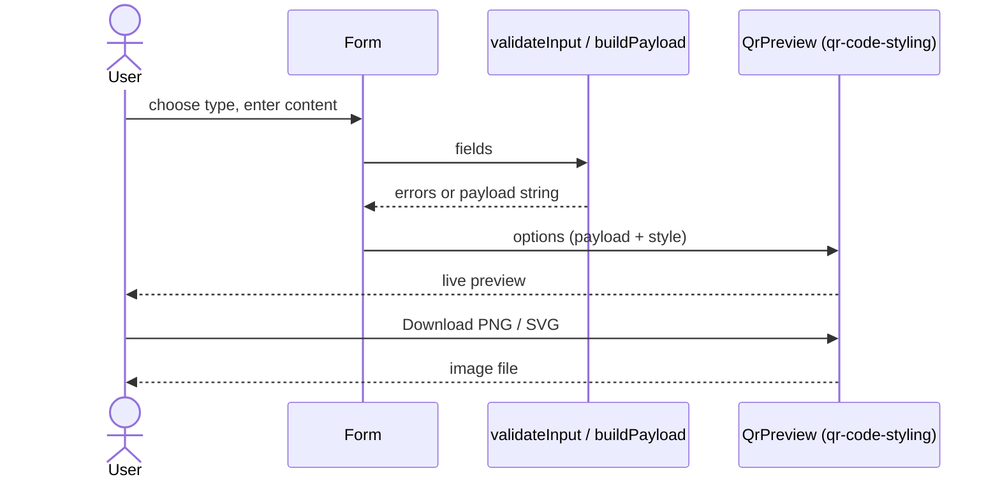

# User manual

## Create and download a QR code
1. Pick a content type from the tabs (use the arrow keys to move between tabs).
2. Fill in the form. Required fields are marked `*`; errors appear after you leave a field.
3. (Optional) Open **Style** to change colors, dot and corner shapes, size, error correction, or add a logo.
4. Check the preview and any contrast warning. Test-scan the code with your phone.
5. Click **Download PNG** or **Download SVG**.

## Tips
- Phone numbers may include spaces, dashes and parentheses; letters are rejected.
- Dark code on a light background scans best. Logos are covered by high error correction, so keep them small.
- Very long content cannot fit in a QR code; shorten it if you see the "too long" message.
