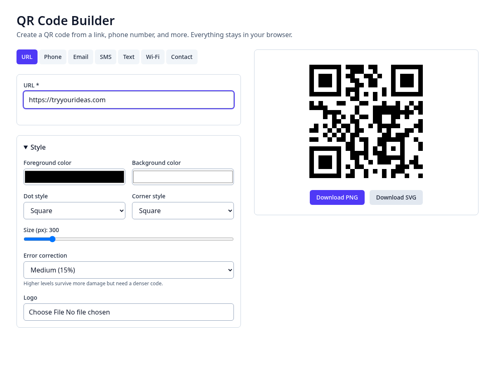
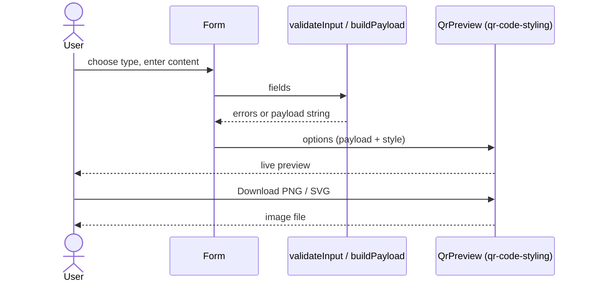
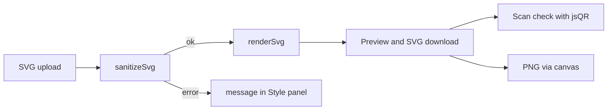

# User manual

## Create and download a QR code
1. Pick a content type from the tabs (use the arrow keys to move between tabs).
2. Fill in the form. Required fields are marked `*`; errors appear after you leave a field.
3. (Optional) Open **Style** to change colors, dot and corner shapes, size, error correction, or add a logo.
4. Check the preview and any contrast warning. Test-scan the code with your phone.
5. Click **Download PNG** or **Download SVG**.

## Use your own eye or dot shape
1. Open **Style**.
2. Under **Custom eye (SVG)** choose an SVG file. It is used for all three corner eyes: top-left as drawn, top-right rotated -90°, bottom-left rotated +90°. Under **Custom dot (SVG)** choose an SVG used for every data dot.
3. Check the preview. If a yellow message says the code may not scan reliably, simplify the design or increase contrast, then test with your phone.
4. Use **Remove custom eye** / **Remove custom dot** to go back to the previous bundled shape.

Tips:
- Design the eye in a square 7x7 box so it keeps the dark ring / light ring / dark center look scanners expect.
- Use dark colors on the light background; uploaded SVGs keep their own colors.
- Keep dot tiles filling most of their square; tiny dots may not scan.
- Files must be square SVGs of at most 200 KB. Scripts, event handlers and external links inside the SVG are removed automatically.

## Tips
- Phone numbers may include spaces, dashes and parentheses; letters are rejected.
- Dark code on a light background scans best. Logos are covered by high error correction, so keep them small.
- Very long content cannot fit in a QR code; shorten it if you see the "too long" message.
